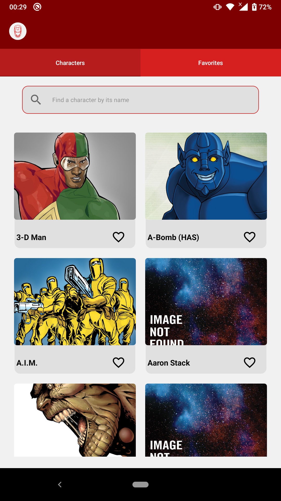
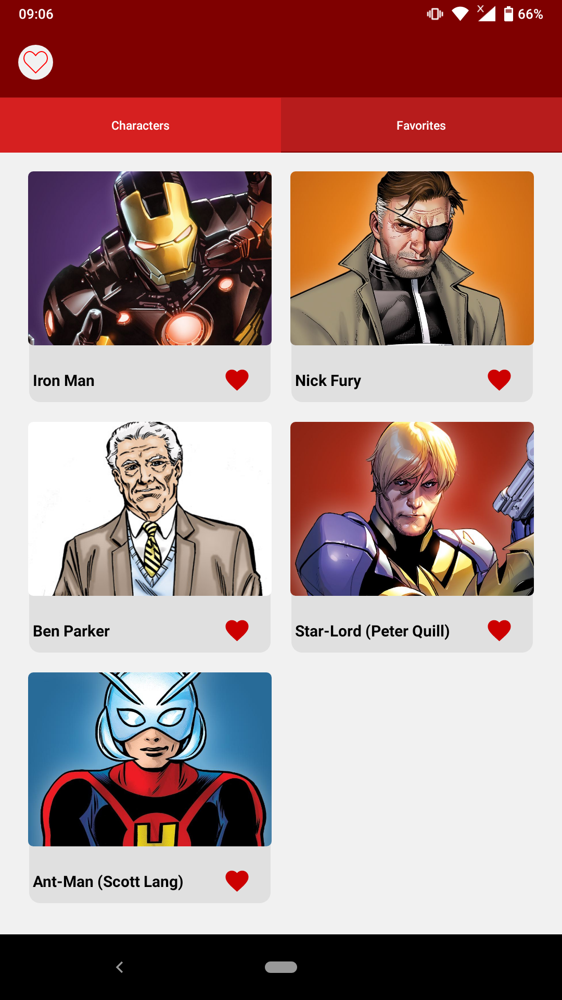
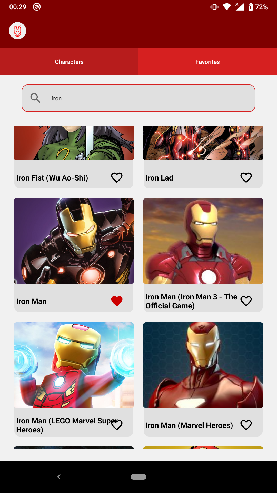
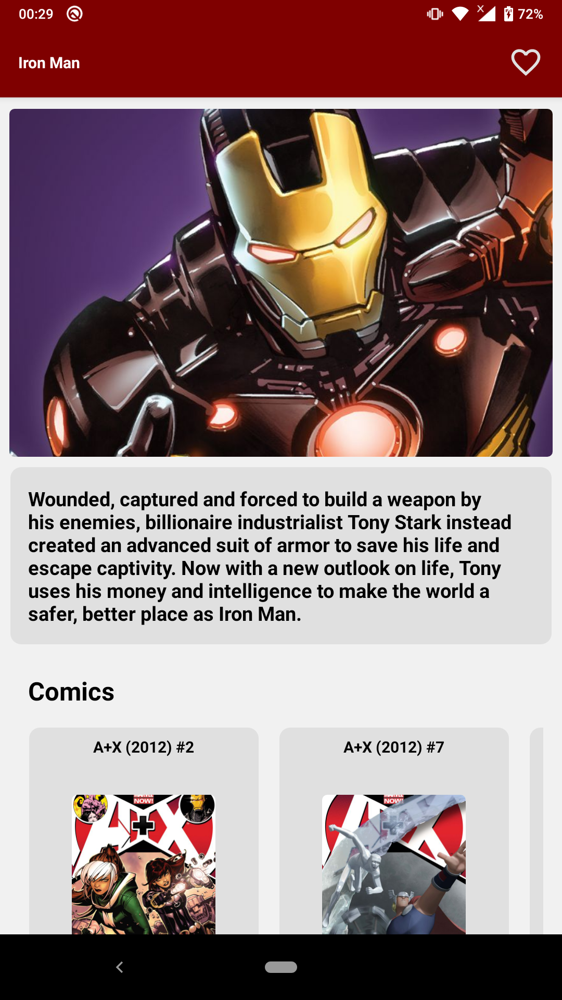
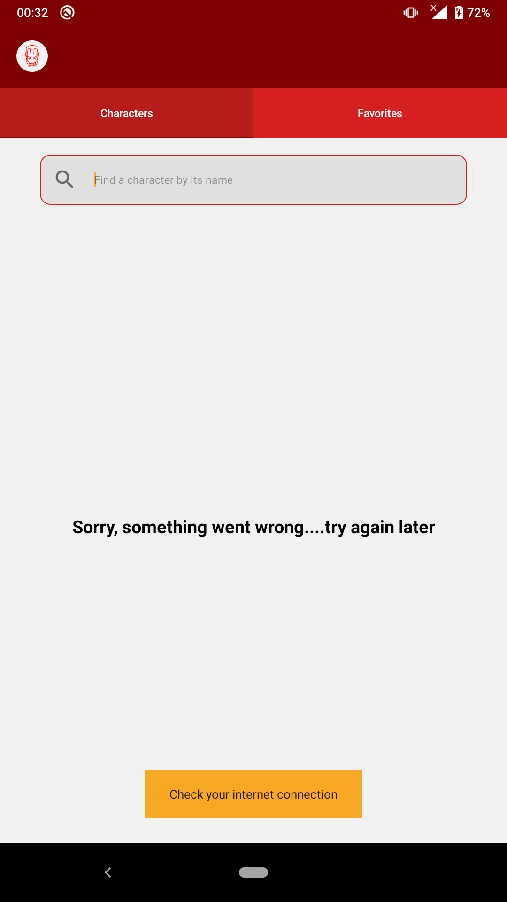
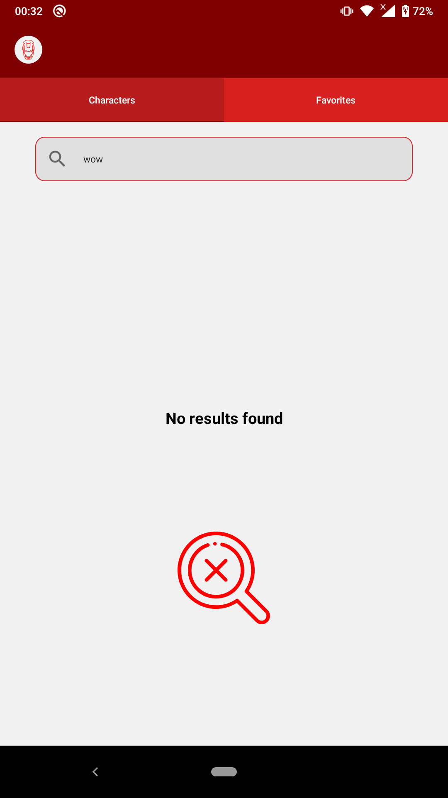

# Marvel Characters

## Description
 Sample app based on Marvel's API, using MVVM design pattern
taking advantage of the jetpack tools:

- Navigation
- ViewModel
- Coroutines
- ViewPager2
- Android X
- Room
- Lifecycle

#### Third party tools:

- Glide
- Connector

## layout

<h3 align="center">
  
</h3>

## Origin

challange:

http://gateway.marvel.com/v1/public/comics/24571

## Requirements
-   MinSdk 21+ (Android 5.0)

## Screen

## License
This project is licensed under the terms of the MIT license. See the LICENSE file.
